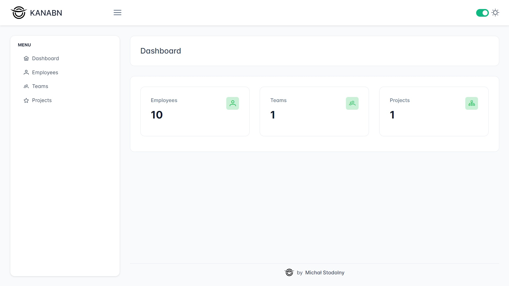
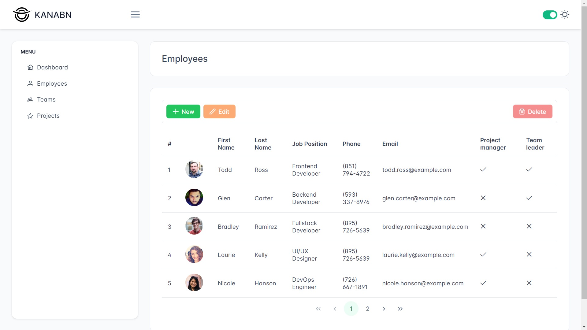
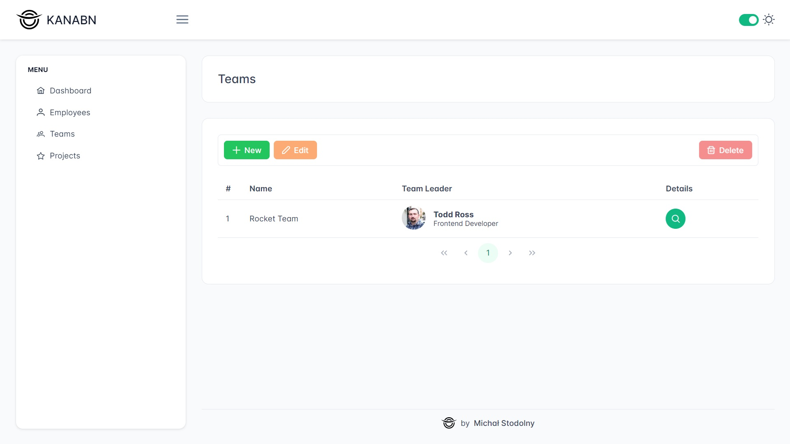
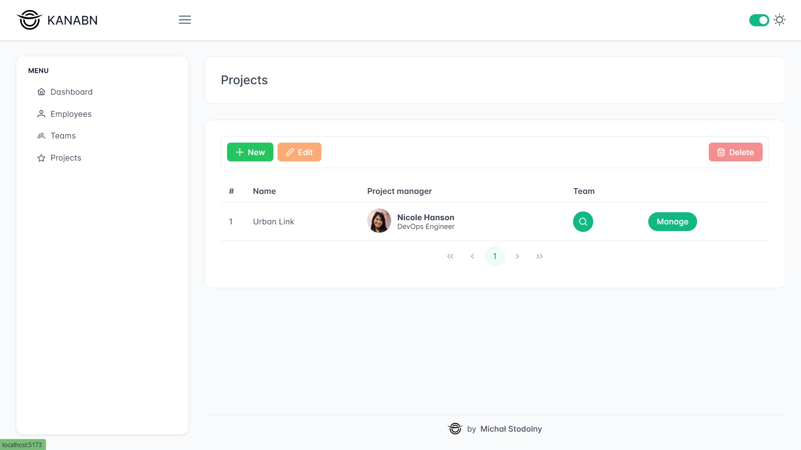
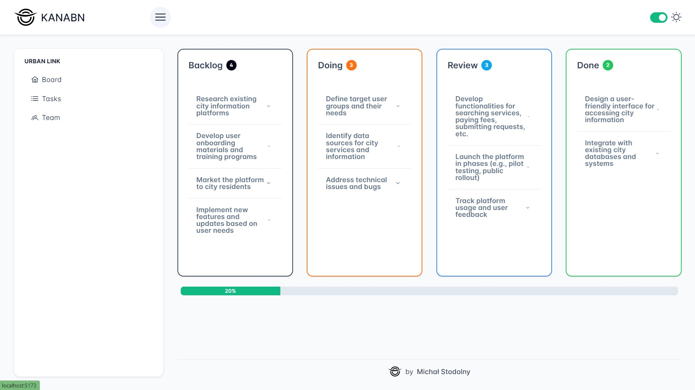
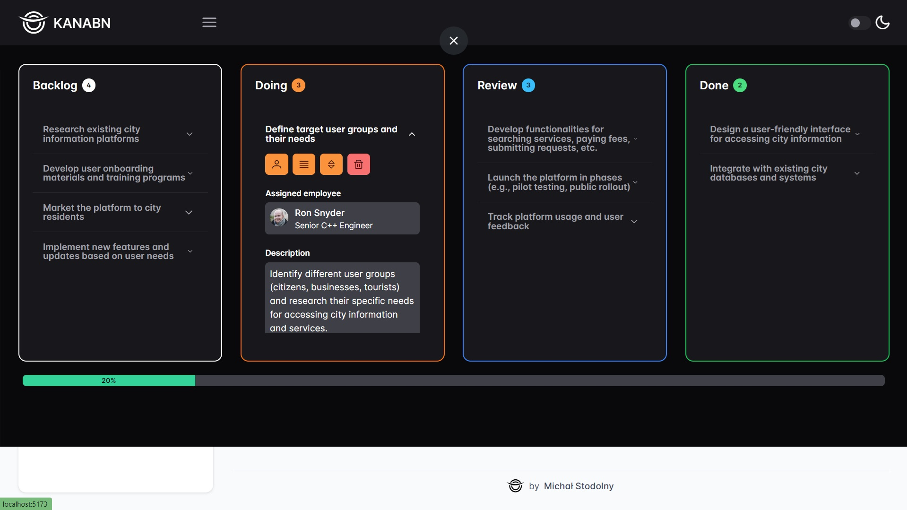
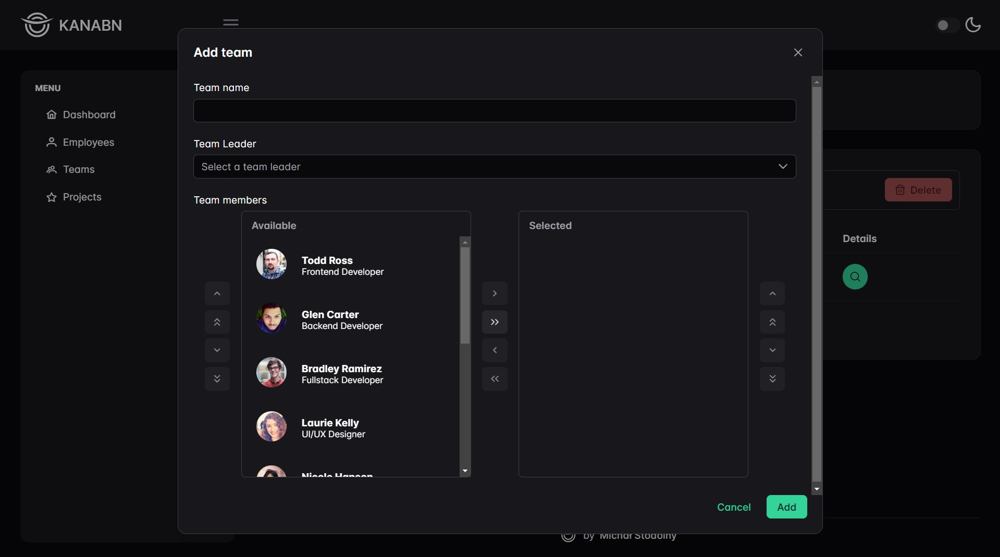

# vue-kanban

Kanban is an app that supports teams in creating and managing big scale projects. You can add your employees then make out of them a team and start your project that will change the world! 
## Dashboard


## Employees


## Teams


## Projects


## Kanban


## Dark theme!



# Tech Stack

Project is build on Vue.js framework with the Composition Api approach. For better design I used PrimeVue - UI Component Library and Primeflex as a support for CSS. State of the app is managed by Pinia library.

## Project Setup

```sh
npm install
```

## Compile and Hot-Reload for Development

```sh
npm run dev
```